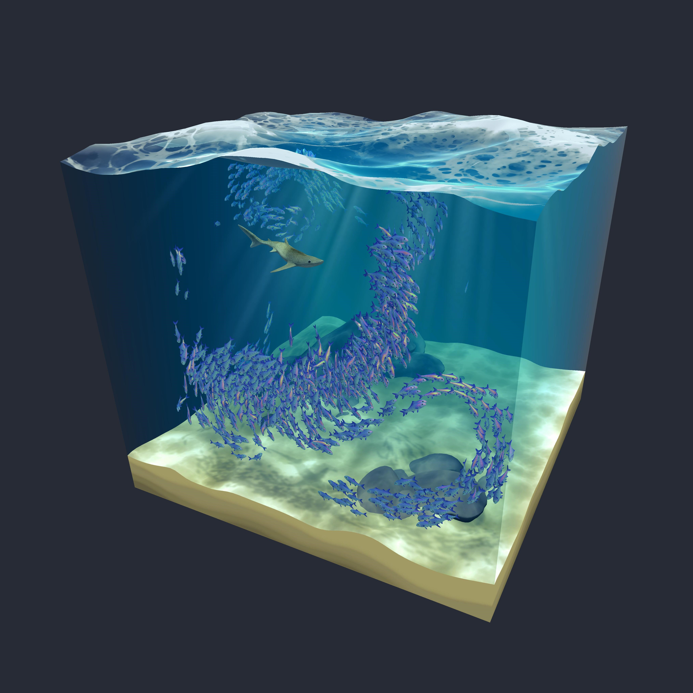

# Boids
## Description
This project is a real time 3D simulation of boids (a 'boid', derived from 'bird', is used to describe entities that interact together to form flocks. In my case, these entities are fishes) created with Unity. It features flocking behavior, obstacle avoidance, and interactions with predators. Entities are procedurally animated with 3D graphics and shaders. A simple user interface also allows to control the main aspects of the simulation. 

Developed as a first Unity project for fun and learning.



## Installation

Follow these steps to install and run the project locally on your machine:

1. Clone the GitHub repository:

    ```bash
    git clone https://github.com/VivianMenard/boids.git
    ```

2. Open the project in Unity:

    - Launch Unity Hub.
    - Click on the "Add" button and select the folder where you cloned the repository.
    - Once the project is added, select it in Unity Hub to open it in the Unity editor.

3. Ensure you are using a compatible version of Unity. This project was developed with `Unity 2022.3.16f1` (but it may work with other versions as well) and requires the Universal Render Pipeline (URP), TextMeshPro, and Shader Graph to function properly. 


4. Run the project:

    - In the Unity editor, open the `MainScene` of the project.
    - Click on the "Play" button to start the simulation.

That's it! You should now have the project installed and running on your machine. Feel free to explore and modify the code to see how it works.

## Usage

- **Camera Controls**:
  - **Rotate view**: Click and drag to rotate the view.
  - **Pan view**: Click and drag with the middle mouse button to pan the view.
  - **Zoom in/out**: Use the scroll wheel to zoom in and out.
  - **Reset camera view**: Press 'C' to reset the camera view.

- **UI Controls**:
  - **Toggle UI**: Press 'U' to hide or show the UI.

- **Simulation Parameters**:
  - **Adjust fishes and sharks**: Change the number of fishes and sharks in the Parameters tab.
  - **Show FPS**: Enable the FPS display in the Parameters tab.

- **Pause Simulation**:
  - Use the Pause button to pause and resume the simulation.

- **Advanced Settings**:
  - For more advanced parameter adjustments, modify the settings in the `EntitiesManager` component in the Inspector.

## Main Features

- **Flocking Behavior**: Realistic boid behavior simulating flocking, including alignment, cohesion, and separation.
- **Predator Interaction**: Implementation of predator entities that interact with boids, adding complexity and challenge to the simulation.
- **Obstacle Avoidance**: Entities can detect and avoid obstacles dynamically within the simulation environment.
- **State Machine Mechanism**: Entities use state machines to exhibit a variety of behaviors, adding depth and interest to the simulation.
- **Procedural Animation**: Entities are animated procedurally, providing smooth and natural movements.
- **3D Graphics and Shaders**:
  - Fishes, sharks and sea floor 3D models.
  - **Water Shader**: Includes wave movement, refraction, absorption, foam, and reflections.
  - **Caustics Shader**: Adds realistic light patterns on underwater surfaces.
  - **Godrays Shader**: Creates shafts of light penetrating through water surface.
  - **Fish Scale Reflection Shader**: Enhances the visual appeal of fish entities with reflective scales.
- **User Interface**: Simple UI to control main parameters of the simulation and to pause it.
- **Intuitive Camera Controls**: Allows users to easily navigate and view the simulation from any desired angle.

## Documentation

For a detailed explanation of the mathematical and algorithmic principles behind this project, please refer to the [Technical Documentation](./technical_documentation.pdf).

## Author

I'm Vivian Ménard, the developer behind this project. I recently completed an engineering degree with a specialization in computer science at l'École Centrale de Lyon in France. I'm passionate about development, algorithms, and mathematics.

If you have any questions or suggestions, feel free to reach out to me via email at menardvivian@gmail.com or via [my LinkedIn profile](https://www.linkedin.com/in/vivian-m%C3%A9nard-a30376202/).

## Acknowledgements & Resources

I would like to thank [Anastasia Kasyanik](https://www.linkedin.com/in/anastasia-kasyanik-b5a5a2170/) for her artistic advice on the project.

I would also like to thank the authors of the following resources that help me in my project:
- [Flocks, Herds, and Schools: A Distributed Behavioral Model](https://team.inria.fr/imagine/files/2014/10/flocks-hers-and-schools.pdf) by Craig W. Reynolds, for the basis behind boids behavior.
- [How Games Fake Water](https://www.youtube.com/watch?v=PH9q0HNBjT4&list=PLz_az9HWXUw1zG6iDTOjvVzGS2qwYiJ_n&index=21&ab_channel=Acerola), for the mathematical basis behind water movement.

## License

This project is licensed under the MIT License. See the [LICENSE](LICENSE) file for details.